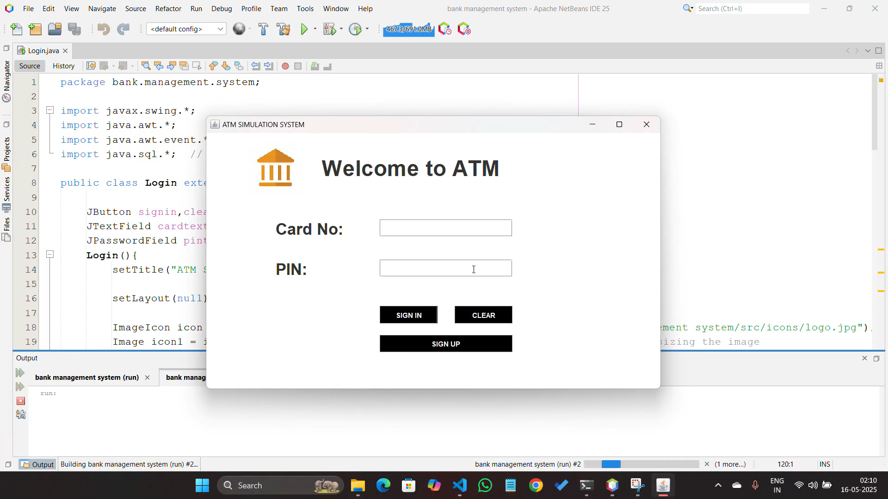
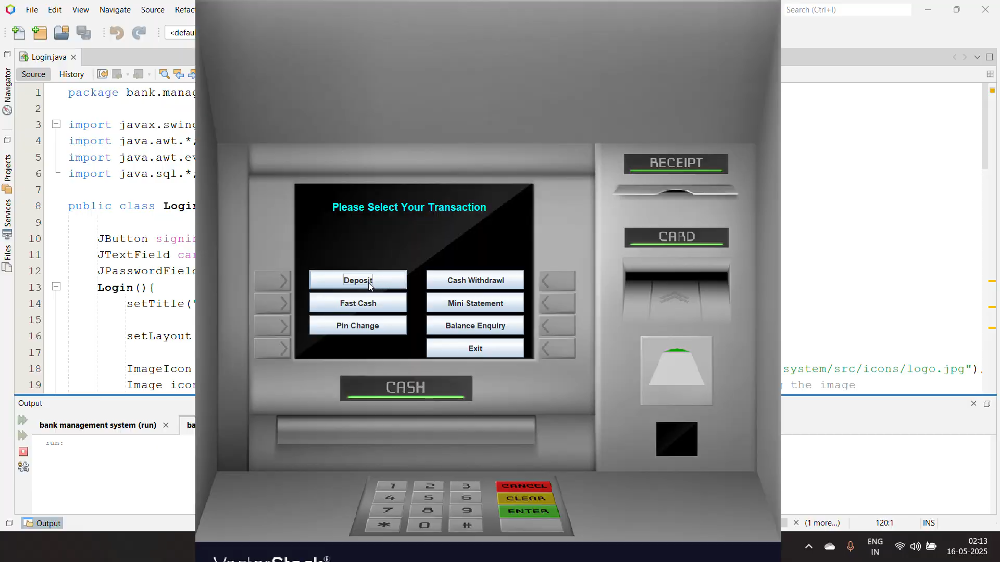
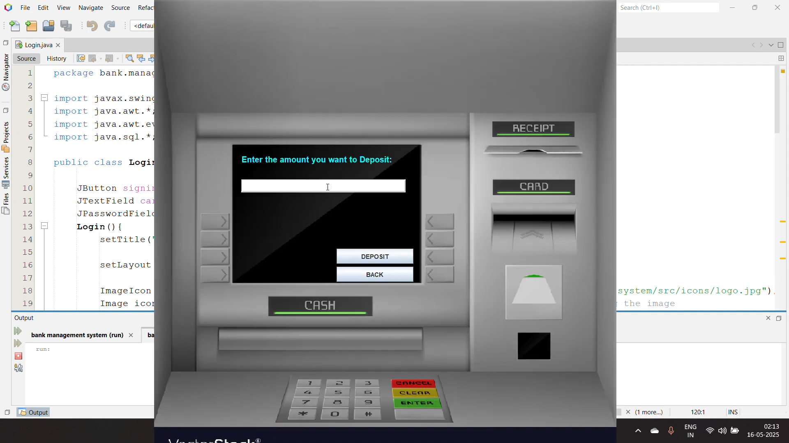

# 💳 ATM Simulation System – Java Desktop Application

A desktop-based ATM Simulation System developed using **Java (Swing & AWT)** that replicates real-world banking operations such as account login, balance inquiry, cash withdrawal, deposit, and transaction history.

This project demonstrates object-oriented programming principles and GUI-based application development in Java.

---

## 🚀 Project Overview

The ATM Simulation System mimics the functionality of a real ATM machine by allowing users to:

- 🔐 Secure Login using account number & PIN
- 💰 Check account balance
- 💵 Withdraw money
- 💳 Deposit money
- 📜 View transaction history
- 🚪 Logout securely

The system provides a simple and interactive graphical user interface for a smooth user experience.

---

## 🛠 Tech Stack

### 🔹 Programming Language
- Java

### 🔹 GUI Framework
- Java Swing
- AWT

### 🔹 Database
- MySQL (if applicable)
- JDBC for database connectivity

---

## 🏗 System Architecture

User (GUI - Swing/AWT)  
⬇  
Java Application Logic  
⬇  
Database (MySQL via JDBC)

---

## ✨ Features

- ✅ Secure authentication system
- ✅ PIN verification
- ✅ Real-time balance updates
- ✅ Transaction recording
- ✅ Interactive GUI interface
- ✅ Object-Oriented design structure
- ✅ Exception handling for invalid inputs

---

## 🎯 Learning Outcomes

This project helped me strengthen:

- Object-Oriented Programming (OOP)
- Java GUI development
- JDBC connectivity
- Event-driven programming
- Database integration
- Exception handling

---

## 📸 Screenshots

### 🔐 Login Page

### 💰 Transaction Dashboard

### 💵 Deposit Page

---

## 👨‍💻 Author

**Farhan Ahmed**

- LinkedIn: https://www.linkedin.com/in/farhanahmedf21  
- GitHub: https://github.com/frhanahmed  
- Portfolio: https://frhanahmed.github.io/Portfolio/

---

## ⭐ If You Like This Project

Give it a star on GitHub ⭐  
It motivates me to build more practical and real-world applications!
